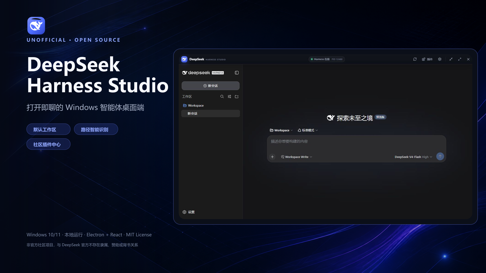

# DeepSeek Harness Studio

> 非官方社区项目：一个面向 Windows 的 DeepSeek Harness 桌面客户端。

界面采用现代智能体产品的分栏布局，真正复用官方 `@deepseek-ai/dsh` 运行时，而不是静态聊天页面。

[](https://github.com/Maskicruis/deepseek-harness-studio/releases/latest)
[](https://github.com/Maskicruis/deepseek-harness-studio/releases/download/v1.06.0/DeepSeek-Harness-Studio-Setup-1.06.0-x64.exe)



## 安装使用

**直接下载最新版（Windows 10/11）：**

- ⬇️ 安装版（推荐）：[DeepSeek-Harness-Studio-Setup-1.06.0-x64.exe](https://github.com/Maskicruis/deepseek-harness-studio/releases/download/v1.06.0/DeepSeek-Harness-Studio-Setup-1.06.0-x64.exe)（约 147 MB，一键静默安装）
- ⬇️ 便携版：[DeepSeek-Harness-Studio-Portable-1.06.0-x64.exe](https://github.com/Maskicruis/deepseek-harness-studio/releases/download/v1.06.0/DeepSeek-Harness-Studio-Portable-1.06.0-x64.exe)（免安装，解压即用）

历史版本见 [Releases](https://github.com/Maskicruis/deepseek-harness-studio/releases)。

**安装后配置视觉识图（3 步）：**

1. 打开 Studio「偏好设置 → 视觉能力」，视觉引擎默认就是「阿里千问 Qwen-VL」；
2. 粘贴阿里云百炼 DashScope API Key（`sk-` 开头）→ 点「保存并重启」；
3. 在 Harness 模型选择器选名称带 `(modlens vision)` 的模型，粘贴图片即可识图。

**升级方式：** 在「偏好设置 → 软件更新」检查更新，点「立即更新」即可静默覆盖安装并自动重启，无需重新走安装流程。

## 已实现

- 原生无边框桌面窗口、启动动画、运行状态与故障恢复。
- 官方 Harness Web UI：会话、工作区、模型设置、工具调用、权限、Skills、子智能体等能力由 Harness 提供。
- 社区插件中心：支持 npm 包、`github:owner/repo`、GitHub URL 和本地插件目录。
- 精选生态组件：内置 ModLens 视觉、ModSearch 联网搜索、PPTFast、DSH Backup 和 DSH Screenshot 的版本化一键接入入口。
- ModLens 视觉 API 设置：默认「阿里千问 Qwen-VL」（阿里云百炼 DashScope，国内直连），其余 Gemini、Anthropic、Claude CLI、OpenAI 兼容等多模态端点折叠进「高级选项」；检测引擎状态并在保存后自动重启 Harness；API Key 不进入项目或 Git。
- Token 余额显示：顶栏实时显示 DeepSeek 账户余额，点击可刷新；读取 `~/.dsh/.credentials.yaml` 中的 `DEEPSEEK_API_KEY`。
- DSH Skill 管理：导入、发现和移除包含 `SKILL.md` 的本地技能包；Harness 可热刷新并通过 `/skill-name` 调用。
- 插件启用 / 停用 / 卸载：直接管理 `~/.dsh/profiles/web` 的依赖与 bundles。
- 安装过程日志、可信来源提示，以及插件变更后的 Harness 自动重启。
- 默认工作区、本地端口、Windows 开机启动和运行时路径管理。
- 零配置新会话：首次启动自动创建并注册 `%USERPROFILE%\Documents\DeepSeek Harness\Workspace`。
- 智能路径识别：聊天中出现 `E:\project`、`C:/work/app`、UNC 路径或具体文件时，自动识别并注册已有目录；显式路径优先于默认工作区。
- 安装版与免安装版 Windows 可执行文件。
- 应用内更新：启动后可自动检测 GitHub Releases；下载自动走系统代理（环境变量优先，其次 Windows 系统代理），支持国内社区镜像优先、GitHub 自动回退和自定义 gh-proxy 前缀，安装包始终强制验证 SHA-256；更新采用静默覆盖安装并自动重启，无需重新走安装向导。
- DeepSeek 官方 Harness 随附的鲸鱼图标，用于窗口和可执行文件。

## 开发运行

环境要求：Windows 10/11、Node.js 24、npm。首次安装依赖：

```powershell
npm install
npm run dev
```

浏览器中单独预览桌面壳层：

```powershell
npm run dev:web
```

## 从源码构建

```powershell
npm test
npm run dist
```

输出位于 `release/`：

- `DeepSeek-Harness-Studio-Setup-1.06.0-x64.exe`：推荐的 one-click 安装版，双击即可静默安装，后续更新自动覆盖并重启。
- `DeepSeek-Harness-Studio-Portable-1.06.0-x64.exe`：免安装版。

构建脚本会先运行 `npm run runtime:prepare`，把当前 Node.js 24 运行时复制到打包资源中，因此成品不依赖用户系统 PATH；该大型二进制不提交到 Git。Harness 本身作为 production dependency 一同打包。

## 文档

- 安装、部署与数据迁移：[docs/INSTALL_CN.md](docs/INSTALL_CN.md)
- 精选生态组件与 ModLens 使用：[docs/COMPONENTS_CN.md](docs/COMPONENTS_CN.md)
- 版本更新与 GitHub 发布：[docs/UPDATES_CN.md](docs/UPDATES_CN.md)

## 版本说明

- v1.06.0 —— 视觉模块简化（默认阿里千问）与静默覆盖升级，见 [docs/RELEASE_NOTES_1.06.0_CN.md](docs/RELEASE_NOTES_1.06.0_CN.md)。
- v1.5.0 —— 阿里千问视觉引擎、Token 余额显示与更新器代理优化，见 [docs/RELEASE_NOTES_1.5.0_CN.md](docs/RELEASE_NOTES_1.5.0_CN.md)。
- v1.4.1 —— 国内更新镜像、自动回退与校验策略，见 [docs/RELEASE_NOTES_1.4.1_CN.md](docs/RELEASE_NOTES_1.4.1_CN.md)。
- v1.4.0 —— 视觉 API 配置、安全策略与故障说明，见 [docs/RELEASE_NOTES_1.4.0_CN.md](docs/RELEASE_NOTES_1.4.0_CN.md)。
- 各版本变更汇总见 [CHANGELOG.md](CHANGELOG.md)。

## 插件导入

插件中心最终调用官方命令：

```powershell
dsh plugin --profile web add <source>
dsh plugin --profile web remove <package>
```

启停开关会修改：

```text
%USERPROFILE%\.dsh\profiles\web\package.json
```

内置的 `@deepseek-ai/dsh-base` 与 `@deepseek-ai/dsh-web-app` 不允许停用或卸载。社区插件拥有的权限取决于其代码及 Harness composition，安装前应审查来源。GitHub 插件的 `prepare` 构建脚本可能被 pnpm 拦截，此时安装日志会显示需要添加到 `allowBuilds` 的包名。

## 配置与故障排查

- 主智能体 API、模型供应商与主题：进入 Harness 内部的“设置”。
- ModLens 视觉 API：进入 Studio 右上角“偏好设置 → 视觉能力”，默认使用阿里千问 Qwen-VL。主智能体继续使用 DeepSeek 文本模型；ModLens 另行调用阿里千问识图。
- Studio 偏好：窗口右上角齿轮。
- Harness 数据：`%USERPROFILE%\.dsh`。
- 默认 Web profile：`%USERPROFILE%\.dsh\profiles\web`。
- 默认地址：`http://127.0.0.1:3080`，只监听本机。
- 默认工作区：`%USERPROFILE%\Documents\DeepSeek Harness\Workspace`。不需要预先选择目录即可开始第一段对话。
- 消息内路径：建议使用绝对路径或引号包裹带空格的路径，例如 `“E:\My Project”`。不存在的目录不会被客户端擅自创建，仍交由智能体按消息要求处理。
- 端口冲突时，在 Studio 偏好里改用 1024–65535 范围内的其他端口。

## 工程结构

```text
electron/
  main.cjs                  Electron 主进程与 IPC
  preload.cjs               安全的渲染层桥接
  lib/runtime-manager.cjs   Harness 生命周期与就绪探测
  lib/plugin-manager.cjs    社区插件清单、导入、启停与卸载
  lib/modlens-manager.cjs   ModLens Provider 配置、状态诊断与安全代理
  lib/update-manager.cjs    GitHub Release 检测、下载与完整性校验
src/
  App.jsx                   桌面界面
  styles.css                视觉系统与动效
tests/                      Node 内置测试
assets/runtime/node.exe     随应用分发的 Node.js 运行时
build/app.ico               Windows 可执行文件图标
build/update-config.json    发行版默认更新仓库
```

## 品牌说明

本项目是非官方社区客户端，与 DeepSeek 官方不存在隶属、赞助或背书关系。DeepSeek 名称、商标与图标归其权利人所有。本工程用于包装其开源 Harness；对外分发或商业使用前，请自行确认已获得适当的品牌授权。详见 [THIRD_PARTY_NOTICES.md](THIRD_PARTY_NOTICES.md)。

## 参与贡献

欢迎提交 Issue、功能建议与 Pull Request。开始前请阅读 [CONTRIBUTING.md](CONTRIBUTING.md)；安全问题请按 [SECURITY.md](SECURITY.md) 中的方式私下报告。

开源首发、社区短文案、英文简介与发布检查清单见 [docs/PROMOTION_CN.md](docs/PROMOTION_CN.md)。宣传图片位于 `docs/assets/`，可运行 `npm run promo:build` 重新合成。
